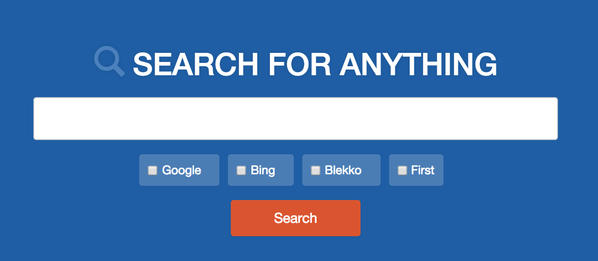

## Go Training - Day 3
On this day we build a program that implements functionality that can be found in many Go programs being developed today. The program provides a sample to the html package to create a simple search engine. The engine supports Google, Bing and Blekko searches. You can request results for all three engines or ask for just the first result. Searches are performed concurrently. Use the GOMAXPROCS environment variables to run the searches in parallel.

*Note: This material has been designed to be taught in a classroom environment. The code is well commented but missing some of the contextual concepts and ideas that will be covered in class.*

#### Sample Program

#### [Program Documentation](../web_app/readme.md)

___

___
All material is licensed under the [GNU Free Documentation License](https://github.com/ArdanStudios/gotraining/blob/master/LICENSE).