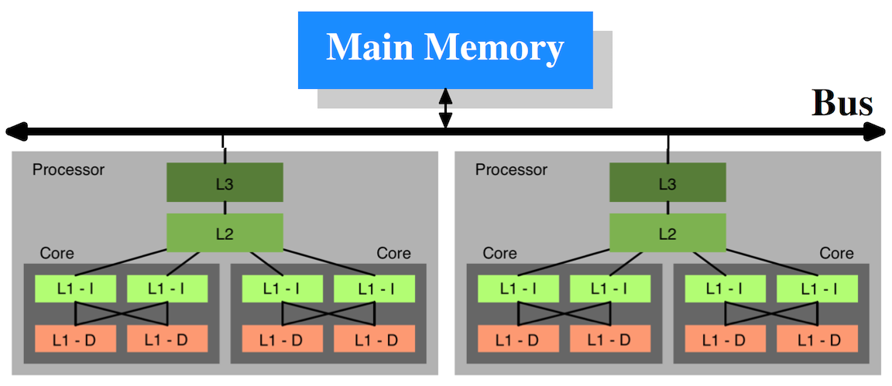

## Arrays - Arrays, Slices and Maps

Arrays are a special data structure in Go that allow us to allocate contiguous blocks of fixed size memory. Arrays have some special features in Go related to how they are declared and viewed as types.

## Notes

* Arrays are fixed length data structures that can't change.
* Arrays of different sizes are considered to be of different types.
* Memory is allocated as a contiguous block.

## CPU Caches
This content is provided by Scott Meyers from his talk in 2014 at Dive:

[CPU Caches and Why You Care (18:50-20:30)](https://youtu.be/WDIkqP4JbkE?t=1129)

[CPU Caches and Why You Care (44:36-45:40)](https://youtu.be/WDIkqP4JbkE?t=2676)

## CPU Cache Notes

* CPU Caches works by caching memory on cache lines.
* On our 64 bit processors, the cache line will be 64 bytes.
* Cache lines are moved and stored in L1, L2 and L3 caches.
* Memory in L1 and L2 caches is also in L3 cache.
* Both data and instructions are stored in these caches.
* By default all data read or written by the CPU cores is stored in the cache.
* When memory content is needed by the processor the entire cache line is loaded into the L1d.
* CPU access L1 cache, cached data is pushed down to L2 and then L3.
* Hardware likes to traverse data and instructions linearly along cache lines.
* Access to main memory is incredibly slow, we need the cache.
	* Accessing one byte from main memory will cause an entire cache line to be read.
	* Writes to one byte in a cache line requires the entire cache line to be written.
* Small = Fast
	* Compact, well localized code that fits in cache is fastest.
	* Compact data structures that fit in cache are fastest.
	* Traversals touching only cached data is the fastest.
* Predictable access patterns matter.
	* Provide regular patterns of memory access.
	* Hardware can make better predictions about required memory.
* Cache misses can result in TLB cache misses as well.
	* Cache of translations of a virtual address to a physical address.
	* Waiting on the OS to tell us where the memory is.

### Cache Hierarchies
This is a diagram showing the relationship of the cache hierarchy for two processors that each have two cores and each core having two threads. Each core has its own L1 cache that is shared between the threads. The cores share the L2 and L3 caches in this diagram but some architectures, like the one described above from Scott Meyers talk, give each core an individual L2 cache as well.

This is subject to be different in different processors. For this content, the following is the multi-levels of cache associated with the Intel 4 Core i7-9xx processor:

	L1 - 64KB Cache (Per Core)
		32KB I-Cache
		32KB D-Cache
		2 HW Threads

	L2 - 256KB Cache (Per Core)
		Holds both Instructions and Data
		2 HW Threads

	L3 - 8MB Cache
		Holds both Instructions and Data
		Shared across all 4 cores
		8 HW Threads

## Links

https://www.youtube.com/watch?v=WDIkqP4JbkE

http://www.akkadia.org/drepper/cpumemory.pdf

http://www.extremetech.com/extreme/188776-how-l1-and-l2-cpu-caches-work-and-why-theyre-an-essential-part-of-modern-chips

## Code Review

[Declare, initialize and iterate](example1/example1.go) ([Go Playground](http://play.golang.org/p/2D24t6fbW_))

[Different type arrays](example2/example2.go) ([Go Playground](http://play.golang.org/p/nYgwqqOctt))

[Contiguous memory allocations](example3/example3.go) ([Go Playground](http://play.golang.org/p/L-SmdGfUcP))

## Advanced Code Review

[Contiguous Backing Array](advanced/example1/example1.go) ([Go Playground](http://play.golang.org/p/IIubKW34GA))

## Exercises

### Exercise 1

Declare an array of 5 strings with each element initialized to its zero value. Declare a second array of 5 strings and initialize this array with literal string values. Assign the second array to the first and display the results of the first array. Display the string value and address of each element.

[Template](exercises/template1/template1.go) ([Go Playground](http://play.golang.org/p/qKUNW0FSgC)) | 
[Answer](exercises/exercise1/exercise1.go) ([Go Playground](http://play.golang.org/p/px3X_qw_SX))

___

___
All material is licensed under the [Apache License Version 2.0, January 2004](http://www.apache.org/licenses/LICENSE-2.0).