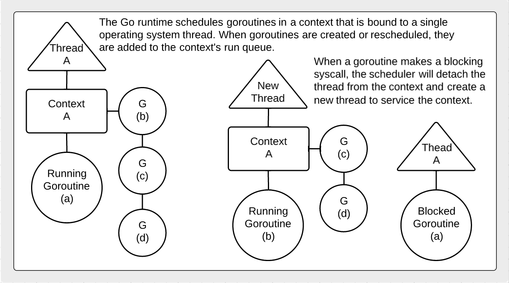

## Scheduler - Goroutines - Concurrency and Channels

### Diagram of how the scheduler works.

### Difference between concurrency and parallelism.

___

___
All material is licensed under the [GNU Free Documentation License](https://github.com/ArdanStudios/gotraining/blob/master/LICENSE).