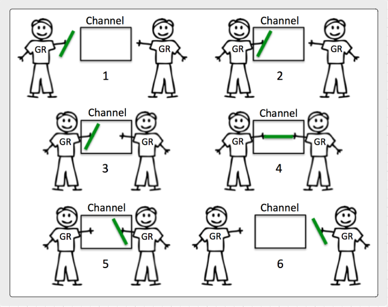

## Channels
Channels are a reference type that provide a safe mechanism to share data between goroutines. Unbuffered channel provide a 100% guarantee of delivery that data has passed from one goroutine to the other. Buffered channels allow for data to pass through the channel without such guarantees. Unbuffered channels require both a sending and receiving goroutine to be ready at the same instant before any send or receive operation can complete. Buffered channels don't force goroutines to be ready at the same instant to perform sends and receives.

## Notes

* Use channels to orchestrate goroutines, not to synchronize access to shared state.
* Unbuffered channels provide a 100% guarantee that data has been exchanged at some point in space and time.
* Buffered channels provide a way of maintaining continuity. Don't use them just for performance.
* Buffered channels if used incorrectly can increase latency not reduce it (Buffer Bloat).
* Closed channels can provide a system wide mechanism for notifications.
* A send on an unbuffered channel happens before the corresponding receive from that channel completes.
* A receive from an unbuffered channel happens before the send on that channel completes.
* The closing of a channel happens before a receive that returns a zero value because the channel is closed.

## Diagrams

### How an unbuffered channel works.

### How a buffered channel works.

## Links

[Channel Communication](https://golang.org/ref/mem#tmp_7)  
http://blog.golang.org/share-memory-by-communicating  
http://www.goinggo.net/2014/02/the-nature-of-channels-in-go.html  
[A Retrospective on SEDA](http://matt-welsh.blogspot.com/2010/07/retrospective-on-seda.html) - Matt Welsh  

## Buffer Bloat - 2011

* Large buffers prevent timely notification of back pressure.
* They defeat your ability to reduce back pressure in a timely matter.
* They can increase latency not reduce it.
* Use buffered channels to provide a way of maintaining continuity.
	* Don't use them just for performance.
	* Use them to handle well defined bursts of data.
	* Use them to deal with speed of light issues between handoffs.

[Bufferbloat: Dark Buffers in the Internet](https://www.youtube.com/watch?v=qbIozKVz73g)  
[Buffer Bloat Videos](http://www.bufferbloat.net/projects/cerowrt/wiki/Bloat-videos)  

## Code Review

[Unbuffered channels - Tennis game](example1/example1.go) ([Go Playground](https://play.golang.org/p/VlxW_v07PQ))  
[Unbuffered channels - Relay race](example2/example2.go) ([Go Playground](https://play.golang.org/p/OsyUwckOie))  
[Buffered channels - Retrieving results](example3/example3.go) ([Go Playground](https://play.golang.org/p/V7ChDKIG5Z))  
[Timer channels and Select](example4/example4.go) ([Go Playground](https://play.golang.org/p/TsJSagQawy))  

## Advanced Code Review

[Channel communication ordering](advanced/example1/example1.go) ([Go Playground](https://play.golang.org/p/b3pPHMYZbX))

## Exercises

### Exercise 1
Write a program where two goroutines pass an integer back and forth ten times. Display when each goroutine receives the integer. Increment the integer with each pass. Once the integer equals ten, terminate the program cleanly.

[Template](exercises/template1/template1.go) ([Go Playground](http://play.golang.org/p/N-8YvtZppu)) | 
[Answer](exercises/exercise1/exercise1.go) ([Go Playground](http://play.golang.org/p/g6zTrNenL3))

### Exercise 2
Write a program that uses a fan out pattern to generate 100 random numbers concurrently. Have each goroutine generate a single random number and return that number to the main goroutine over a buffered channel. Set the size of the buffer channel so no send every blocks. Don't allocate more buffers than you need. Have the main goroutine display each random number is receives and then terminate the program.

[Template](exercises/template2/template2.go) ([Go Playground](http://play.golang.org/p/CpsDFNmazH)) | 
[Answer](exercises/exercise2/exercise2.go) ([Go Playground](http://play.golang.org/p/Li7hl3pOSu))
___
All material is licensed under the [Apache License Version 2.0, January 2004](http://www.apache.org/licenses/LICENSE-2.0).
