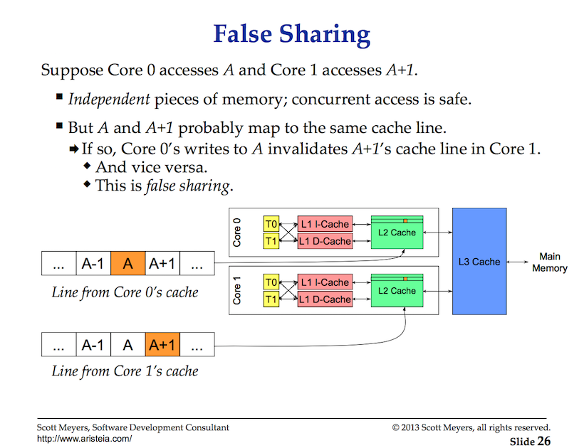

## Data Races

A data race is when two or more goroutines attempt to read and write to the same resource at the same time. Race conditions can create bugs that totally appear random or can be never surface as they corrupt data. Atomic functions and mutexes are a way to synchronize the access of shared resources between goroutines.

## Notes

* Goroutines need to be coordinated and synchronized.
* When two or more goroutines attempt to access the same resource, we have a data race.
* Atomic functions and mutexes can provide the support we need.

## Cache Coherency and False Sharing
This content is provided by Scott Meyers from his talk in 2014 at Dive:

[CPU Caches and Why You Care (30:09-38:30)](https://youtu.be/WDIkqP4JbkE?t=1809)

## Cache Coherency and False Sharing Notes

* Thread memory access matters.

* If your algorithm is not scaling look for false sharing problems.

## Links

[Eliminate False Sharing](http://www.drdobbs.com/parallel/eliminate-false-sharing/217500206)

[The Go Memory Model](https://golang.org/ref/mem)  
http://blog.golang.org/race-detector  
http://www.goinggo.net/2013/09/detecting-race-conditions-with-go.html  
https://golang.org/doc/articles/race_detector.html

## Diagram

### View of Data Race in Example1.

## Code Review

[Data Race](example1/example1.go) ([Go Playground](http://play.golang.org/p/evBf1oagDj))  
[Atomic Increments](example2/example2.go) ([Go Playground](http://play.golang.org/p/uE-2Kl9CtC))  
[Atomic Store/Load](example3/example3.go) ([Go Playground](http://play.golang.org/p/LqgPnirE1c))  
[Mutex](example4/example4.go) ([Go Playground](http://play.golang.org/p/tMH4D6XAXP))  
[Read/Write Mutex](example5/example5.go) ([Go Playground](http://play.golang.org/p/Oc4QO7Fjqa))

## Advanced Code Review

[Interface Based Race Condition](advanced/example1/example1.go) ([Go Playground](http://play.golang.org/p/08Z_uRpPtA))

## Exercises

### Exercise 1
Given the following program, use the race detector to find and correct the data race.

	// https://play.golang.org/p/F5DCJTZ6Lm

	// Fix the race condition in this program.
	package main

	import (
		"fmt"
		"math/rand"
		"sync"
		"time"
	)

	// numbers maintains a set of random numbers.
	var numbers []int

	// init is called prior to main.
	func init() {
		rand.Seed(time.Now().UnixNano())
	}

	// main is the entry point for the application.
	func main() {
		// Number of goroutines to use.
		const grs = 3

		// wg is used to manage concurrency.
		var wg sync.WaitGroup
		wg.Add(grs)

		// Create three goroutines to generate random numbers.
		for i := 0; i < grs; i++ {
			go func() {
				random(10)
				wg.Done()
			}()
		}

		// Wait for all the goroutines to finish.
		wg.Wait()

		// Display the set of random numbers.
		for i, number := range numbers {
			fmt.Println(i, number)
		}
	}

	// random generates random numbers and stores them into a slice.
	func random(amount int) {
		// Generate as many random numbers as specified.
		for i := 0; i < amount; i++ {
			n := rand.Intn(100)
			numbers = append(numbers, n)
		}
	}

[Template](exercises/template1/template1.go) ([Go Playground](http://play.golang.org/p/G7_rJAK8YR)) | 
[Answer](exercises/exercise1/exercise1.go) ([Go Playground](http://play.golang.org/p/GC12H2acgO))
___
All material is licensed under the [Apache License Version 2.0, January 2004](http://www.apache.org/licenses/LICENSE-2.0).
