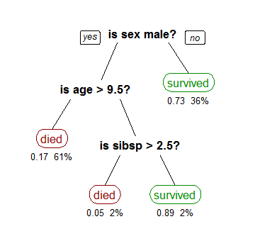

## Classification - Decision Trees

In addition to kNN, decision tree and random forest algorithms are widely used for classification problems.  In a decision tree algorithm, a tree of if/then statements is created based on the features and labeled points of a training set.  In a random forest algorithm, many decision trees are built and the results are combined (a type of "ensemble" model). In these examples, we will explore individual Decision trees.

## Decision Trees

    
from [Wikipedia](https://en.wikipedia.org/wiki/Decision_tree_learning)

## Notes

- "Single decision trees are highly interpretable. The entire model can be completely represented by a simple two-dimensional graphic (binary tree)" - from [The Elements of Statistical Learning](http://statweb.stanford.edu/~tibs/ElemStatLearn/)
- Each level of a decision tree splits the data according to different attributes.
- Decision trees perform best when a small number of attributes provide most of the information needed to classify observations.

## Links

[Introduction to learning and decision trees](https://www.cs.cmu.edu/afs/cs/academic/class/15381-s07/www/slides/041007decisionTrees1.pdf)  

## Code Review

[Train and use cross-validation to validate a single decision tree](example1/example1.go)    
[Tuning the pruning parameter of the decision tree](example2/example2.go)    

## Exercises

### Exercise 1

Visualize the accuracies for each of the pruning parameters used in [example2](example2/example2.go). This should help you quickly identify what parameter would be best for our model.

[Template](exercises/template1/template1.go) |
[Answer](exercises/exercise1/exercise1.go)

___
All material is licensed under the [Apache License Version 2.0, January 2004](http://www.apache.org/licenses/LICENSE-2.0).
