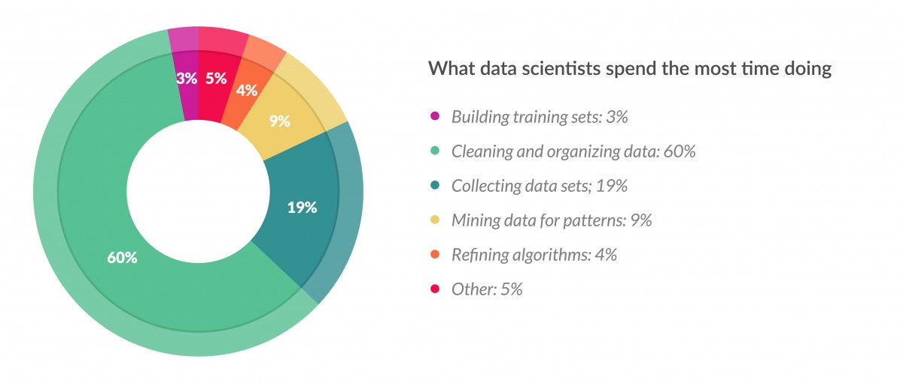

## What is Data Analysis?

Data analysis, and what is sometimes called "Data Science," uses Datasets to make Decisions that have Actions and Consequences.  The process is meant to drive decision making within an organization.  Those practicing data analysis (via code) take advantage of software engineering, statistical, and scientific skills to develop insights from raw data.

## Design, Mechanics and Philoshopy

[The Design, Mechanics and Philoshopy of Data Analysis](design_philosophy.md)   
[The Data Science Bill Of Rights for Rigorous Data Analysis](http://www.pachyderm.io/dsbor.html)

## Practical Skills

* The data analytics/science process almost always involves:
    * Data gathering, organization, and cleaning.
    * Data parsing and/or pattern extraction.
    * Arithmetic
    * Conveying results.
* Sometimes arithmetic includes sophisticated neural networks, but it may just include aggregations (sums, calculating a maximum value, etc.) or fitting a line.
* Conveying results may include passing messages to another backend service or it may include non-technical/visual explanation of predictions. 

from [Forbes](http://www.forbes.com/sites/gilpress/2016/03/23/data-preparation-most-time-consuming-least-enjoyable-data-science-task-survey-says)

## Links - Reading

[Go for Data Science](https://youtu.be/D5tDubyXLrQ)   
[Go Data Science Resources, Tooling, Community](https://github.com/gopherds/resources)     
[Doing data science at Twitter](https://medium.com/@rchang/my-two-year-journey-as-a-data-scientist-at-twitter-f0c13298aee6#.hdprnhlv5)  
[A Guide to Building a High Functioning Data Science Department](http://multithreaded.stitchfix.com/blog/2016/03/16/engineers-shouldnt-write-etl/)  
[Data Science at the Speed of Hype](http://www.john-foreman.com/blog/surviving-data-science-at-the-speed-of-hype)  
[Data Scientists Mostly Just Do Arithmetic and that's a Good Thing](https://m.signalvnoise.com/data-scientists-mostly-just-do-arithmetic-and-that-s-a-good-thing-c6371885f7f6#.cfa7z2m4e)   
[How we do Data Science at People Pattern](https://www.peoplepattern.com/post.html#!/how-we-do-data-science-at-people-pattern)  

## Exercises

### Excercise 1

**Part A** Write down one process within your company that is not currently data-driven.  If you are currently a student or in-between positions, write down a process at a fictional company or within a side-project that should be data-driven (e.g., identifying high value customers).

**Part B** Write down what relevant results you would need to make the process, identified in Part A, data-driven.  We will revisit this at the end of the course.
___
All material is licensed under the [Apache License Version 2.0, January 2004](http://www.apache.org/licenses/LICENSE-2.0).
