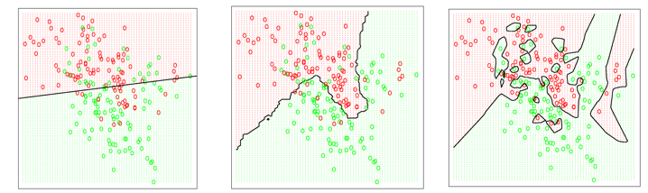
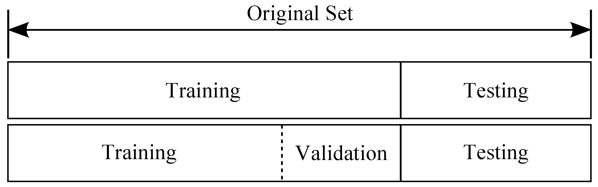

## Validation

Even if you evaluate a model, how can you have any confidence that your model will generalize to data that you have yet to encounter?  In fact, unless you explicitly take steps to "validate" this generalization of the model, you will likely end up with a model that only described the data that was used for "training" (i.e., the model is "overfit").  A variety of validation methods exist, and, as a data scientist, you should be very careful to utilize one or more of these methods to ensure that your model generalizes.

## Notes

- "As model complexity increases (for instance by adding parameters terms in a linear regression) the model will always do a better job fitting the training data." from [here](http://scott.fortmann-roe.com/docs/MeasuringError.html)
- Preventing this "overfitting" is a key to building robust models and data science applications.

## Overfitting

### Regression

    
from [The Shape of Data](https://shapeofdata.wordpress.com/2013/03/26/general-regression-and-over-fitting/)

### Classification

   
from [Chelsea Troy](https://chelseatroy.com/2016/03/22/machine-learning-part-2-classification/)

## 3 Data Set Validation

### Training and Test Data Sets

   
from [Cambridge Coding Academy](https://blog.cambridgecoding.com/2016/03/24/misleading-modelling-overfitting-cross-validation-and-the-bias-variance-trade-off/)

### The 3rd Data Set

   
from [here](http://www.intechopen.com/books/advances-in-data-mining-knowledge-discovery-and-applications/selecting-representative-data-sets)

## Cross Validation

   
from [Kaggle](http://blog.kaggle.com/2015/06/29/scikit-learn-video-7-optimizing-your-model-with-cross-validation/)

## Links

[Accurately Measuring Model Prediction Error](http://scott.fortmann-roe.com/docs/MeasuringError.html)    
[Understanding the Bias-Variance Tradeoff](http://scott.fortmann-roe.com/docs/BiasVariance.html)
___
All material is licensed under the [Apache License Version 2.0, January 2004](http://www.apache.org/licenses/LICENSE-2.0).
