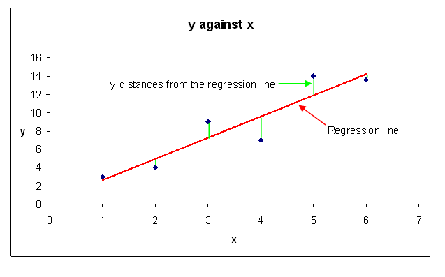

## Regression

Linear regression is widely used to model continuous variables and is used as the basis for other models. It also produces models that are immediately interpretable. Thus, linear regression can provide an excellent starting point when introducing predictive capabilities in a organization.

## Linear Regression / Least Squares

    
from [University of Cumbria](http://ictedusrv.cumbria.ac.uk/maths/SecMaths/U4/page_95.htm)

## Notes

- A linear regression model assumes that the regression function is linear in the inputs.
- A linear regression model assumes normality of the variables.
- Linear regression models "are simple and often provide an adequate and interpretable description of how the inputs affect the output. For prediction purposes they can sometimes outperform fancier nonlinear models, especially in situations with small numbers of training cases, low signal-to-noise ratio or sparse data." from [Elements of Statistical Learning](http://statweb.stanford.edu/~tibs/ElemStatLearn/)

## Links

[Simple Linear Regression - Penn State](https://onlinecourses.science.psu.edu/stat501/node/250)  

## Code Review

[Profile the data](example1/example1.go)  
[Visualize correlations](example2/example2.go)  
[Split the data into training, test, and holdout sets](example3/example3.go)  
[Train and evaluate a linear regression model](example4/example4.go)    
[Validate the linear regression model on the holdout](example5/example5.go)  

## Exercises

### Exercise 1

**Part A** Look again at the scatter plots created in [example2](example2/example2.go).  Select another feature (other than `bmi`) to add to our regression model.

**Part B** Add your selected feature to the model trained in [example4](example4/example4.go) making it a "multiple linear regression" model.  Evaluate your choice.  You may be to try a few different features choices, but try to choose one that improves your model evaluation.  

[Template](exercises/template1b/template1b.go) |
[Answer](exercises/exercise1b/exercise1b.go)

**Part C** After training your new model, validate it on the holdout.

[Template](exercises/template1c/template1c.go) |
[Answer](exercises/exercise1c/exercise1c.go)

___
All material is licensed under the [Apache License Version 2.0, January 2004](http://www.apache.org/licenses/LICENSE-2.0).
