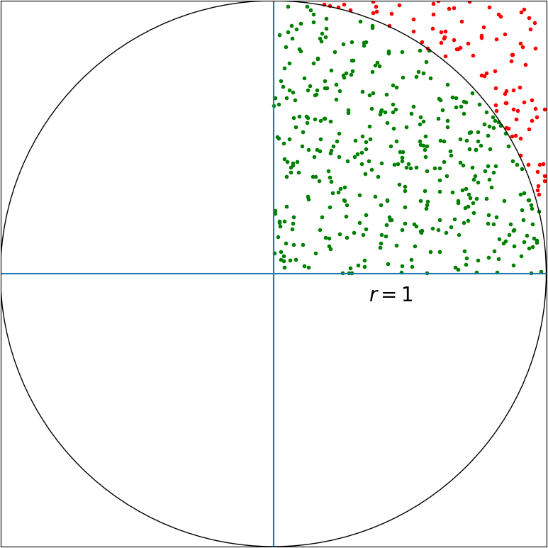

# Calculating π

We're using a circle with radius of 1. This means the circle area is `π*r^2` = π.
Looking at the top right square, it has an area of `1*1=1`, and the circle area inside this square is `π/4`.

We're sampling random points inside this square and calculating the ratio of points that fell inside the circle from the total number of points. This ratio is the area of the circle the is inside the square - `π/4`.

To calculate π we'll multiply the ratio of points falling inside the upper right circle area by 4.
