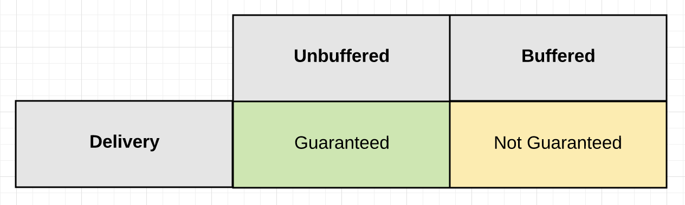
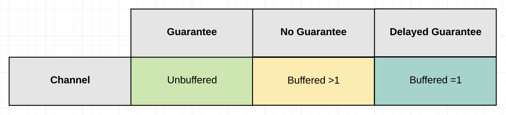
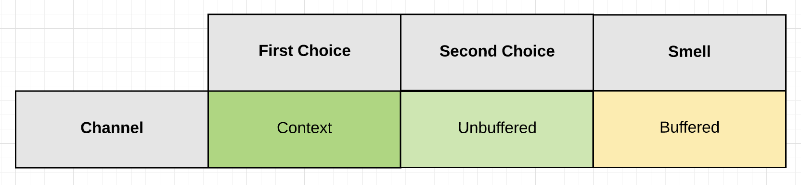
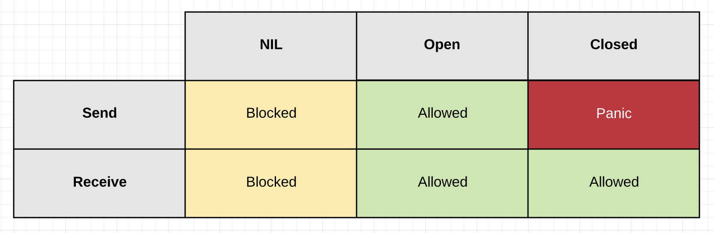

## Channels
Channels allow goroutines to communicate with each other through the use of signaling semantics. Channels accomplish this signaling through the use of sending/receiving data or by identifying state changes on individual channels. Don't architect software with the idea of channels being a queue, focus on signaling and the semantics that simplify the orchestration required.

## Design Guidelines

* Learn about the [design guidelines](../../#channel-design) for channels.

## Diagrams

### Guarantee Of Delivery

The `Guarantee Of Delivery` is based on one question: “Do I need a guarantee that the signal sent by a particular goroutine has been received?”

### Signaling With Or Without Data

When you are going to signal `with` data, there are three channel configuration options you can choose depending on the type of `guarantee` you need.

Signaling without data serves the main purpose of cancellation. It allows one goroutine to signal another goroutine to cancel what they are doing and move on. Cancellation can be implemented using both `unbuffered` and `buffered` channels.

### State

The behavior of a channel is directly influenced by its current `State`. The state of a channel can be `nil`, `open` or `closed`.

## Links

[The Behavior Of Channels](https://www.ardanlabs.com/blog/2017/10/the-behavior-of-channels.html) - William Kennedy  
[Channel Communication](https://golang.org/ref/mem#tmp_7)    
[Share Memory By Communicating](http://blog.golang.org/share-memory-by-communicating) - Andrew Gerrand    
[The Nature Of Channels In Go](https://www.ardanlabs.com/blog/2014/02/the-nature-of-channels-in-go.html) - William Kennedy    
[A Retrospective on SEDA](http://matt-welsh.blogspot.com/2010/07/retrospective-on-seda.html) - Matt Welsh    
[Understanding Channels](https://www.youtube.com/watch?v=KBZlN0izeiY) - Kavya Joshi    

## Buffer Bloat - 2011

* Large buffers prevent timely notification of back pressure.
* They defeat your ability to reduce back pressure in a timely matter.
* They can increase latency not reduce it.
* Use buffered channels to provide a way of maintaining continuity.
	* Don't use them just for performance.
	* Use them to handle well defined bursts of data.
	* Use them to deal with speed of light issues between handoffs.

[Bufferbloat: Dark Buffers in the Internet](https://www.youtube.com/watch?v=qbIozKVz73g)  
[Buffer Bloat Videos](http://www.bufferbloat.net/projects/cerowrt/wiki/Bloat-videos)  

## Code Review

[Basic mechanics](example1/example1.go) ([Go Playground](https://play.golang.org/p/vG1rI7VteNH))  
[Tennis game](example2/example2.go) ([Go Playground](https://play.golang.org/p/PvFKD_tNwir))  
[Relay race](example3/example3.go) ([Go Playground](https://play.golang.org/p/OLdBCGUvzbx))  
[Fan out pattern](example4/example4.go) ([Go Playground](https://play.golang.org/p/zxzHAHIr3Xj))  
[Monitor running time](example5/example5.go) ([Go Playground](https://play.golang.org/p/vZ95XZuYVPF))  

## Advanced Code Review

[Channel communication ordering](advanced/example1/example1.go) ([Go Playground](https://play.golang.org/p/YwKFJPkB4gC))

## Exercises

### Exercise 1
Write a program where two goroutines pass an integer back and forth ten times. Display when each goroutine receives the integer. Increment the integer with each pass. Once the integer equals ten, terminate the program cleanly.

[Template](exercises/template1/template1.go) ([Go Playground](https://play.golang.org/p/gv9lxA3qhH-)) | 
[Answer](exercises/exercise1/exercise1.go) ([Go Playground](https://play.golang.org/p/8S685ND54dW))

### Exercise 2
Write a program that uses a fan out pattern to generate 100 random numbers concurrently. Have each goroutine generate a single random number and return that number to the main goroutine over a buffered channel. Set the size of the buffer channel so no send ever blocks. Don't allocate more buffers than you need. Have the main goroutine display each random number it receives and then terminate the program.

[Template](exercises/template2/template2.go) ([Go Playground](https://play.golang.org/p/9_b6YcBuSOR)) | 
[Answer](exercises/exercise2/exercise2.go) ([Go Playground](https://play.golang.org/p/cEUYThI5etc))

### Exercise 3
Write a program that generates up to 100 random numbers concurrently. Do not send all 100 values so the number of sends/receives is unknown.

[Template](exercises/template3/template3.go) ([Go Playground](https://play.golang.org/p/TQMIiAelw5L)) | 
[Answer](exercises/exercise3/exercise3.go) ([Go Playground](https://play.golang.org/p/76xnxU1yL5K))

### Exercise 4
Write a program that generates up to 100 random numbers concurrently using a worker pool. Reject even values. Instruct the workers to shutdown with 100 odd numbers have been collected.

[Template](exercises/template4/template4.go) ([Go Playground](https://play.golang.org/p/VGU2rHhmBVd)) | 
[Answer](exercises/exercise4/exercise4.go) ([Go Playground](https://play.golang.org/p/9nZ8YgmsAIX))
___
All material is licensed under the [Apache License Version 2.0, January 2004](http://www.apache.org/licenses/LICENSE-2.0).
