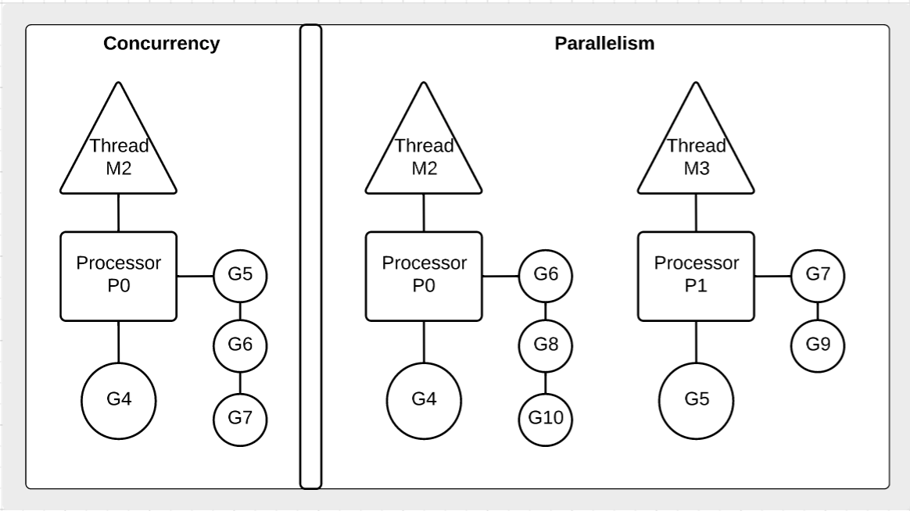

## Goroutines

Goroutines are functions that are created and scheduled to be run independently. Goroutines are multiplexed against a shared thread that is own by context. The scheduler is responsible for the management and execution of goroutines.

## Notes

* Goroutines are functions that are scheduled to run independently.
* The scheduler uses a context that owns an OS thread and goroutine run queue.
* We must always maintain an account of running goroutines and shutdown cleanly.
* Concurrency is not parallelism.
	* Concurrency is about dealing with lots of things at once.
	* Parallelism is about doing lots of things at once.

## Diagrams

### How the scheduler works.

### Difference between concurrency and parallelism.

## Links

http://blog.golang.org/advanced-go-concurrency-patterns

http://blog.golang.org/context

http://blog.golang.org/concurrency-is-not-parallelism

http://talks.golang.org/2013/distsys.slide

[Go 1.5 GOMAXPROCS Default](https://docs.google.com/document/d/1At2Ls5_fhJQ59kDK2DFVhFu3g5mATSXqqV5QrxinasI/edit)

http://www.goinggo.net/2014/01/concurrency-goroutines-and-gomaxprocs.html

http://www.akkadia.org/drepper/cpumemory.pdf

http://www.extremetech.com/extreme/188776-how-l1-and-l2-cpu-caches-work-and-why-theyre-an-essential-part-of-modern-chips

## Code Review

[Goroutines and concurrency](example1/example1.go) ([Go Playground](https://play.golang.org/p/LC1VgZZzO9))

[Goroutine time slicing](example2/example2.go) ([Go Playground](https://play.golang.org/p/WU1p9-_RMN))

[Goroutines and parallelism](example3/example3.go) ([Go Playground](https://play.golang.org/p/1LJPV8HZrG))

## Exercises

### Exercise 1

**Part A** Create a program that declares two anonymous functions. One that counts up to 100 from 0 and one that counts down to 0 from 100. Display each number with an unique identifier for each goroutine. Then create goroutines from these functions and don't let main return until the goroutines complete.

**Part B** Run the program in parallel.

[Template](exercises/template1/template1.go) ([Go Playground](https://play.golang.org/p/V2IfRAWfu7)) | 
[Answer](exercises/exercise1/exercise1.go) ([Go Playground](https://play.golang.org/p/Ci3j0V_lLV))
___
All material is licensed under the [Apache License Version 2.0, January 2004](http://www.apache.org/licenses/LICENSE-2.0).
